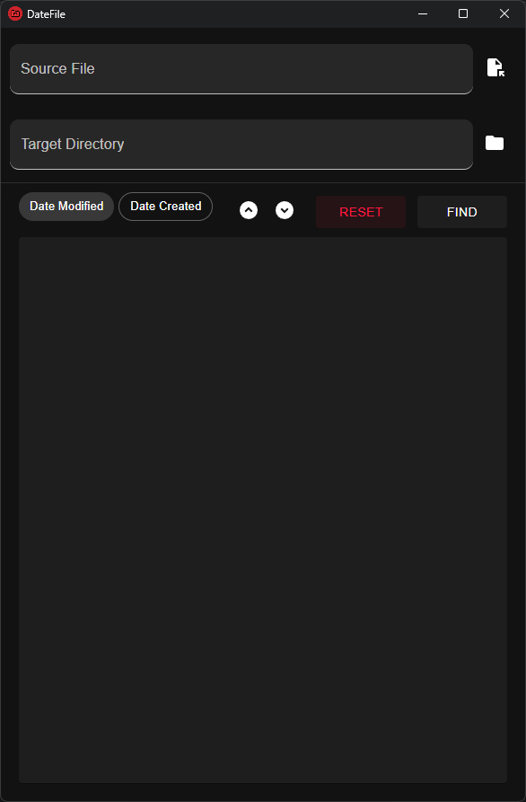

<p align="center">
    <a href="https://github.com/kna40/datefile">
      
    </a>
  <h1 align="center">
    DateFile
  </h1>
</p>

DateFile is a file management application with a user-friendly graphical user interface (GUI) built using Electron, React, and Material-UI (MUI). It simplifies the process of finding files based on the date of another file, making file organization and retrieval easy.

I made this application to help me find old project files in a large and disorganized directory. Using the date of an exported file from the project I am able to find the project file. I also took this as an opportunity to learn electron.

## UI



## Key Features

**Intuitive GUI**: Benefit from a user-friendly interface that simplifies file management tasks.

**Date-based file search**: Easily locate files that have the same date as a specified reference file.

**Preview**: Preview file names, date modified, and date created.

**Open, Copy, and Show**: Allows you to open the file, copy the file location, or show the file location straight from the app.

**Sort**: Sort the results ascending or descending.

## Disclaimer

While this is built using electron, macOS and Linux have not been tested.

It does not look through subdirectories.

Most likely won't keep this updated unless someone can help test on macOS or Linux.

## Installation/Releases

Downloads are available in `releases` section if you just want to download and run or click [here](https://github.com/kna40/datefile/releases/tag/v0.1.0)

## Build on macOS or Linux

**Prerequisites**

- [Node.js](https://nodejs.org/en/download/)

To build DateFile, follow these steps:

1. Clone the repository:

```sh
git clone https://github.com/kna40/datefile.git
```

2.  Install dependencies:

```sh
cd DateFile
npm install
```

3. Build

```sh
npm run build-<platform> //e.g. build-macos
```
